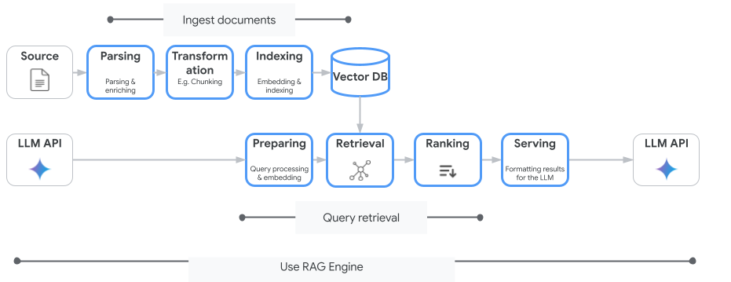

# Hệ thống RAG Chatbot

## Giới thiệu
Hệ thống RAG (Retrieval-Augmented Generation) Chatbot là một ứng dụng cho phép người dùng tải lên tài liệu và đặt câu hỏi dựa trên nội dung của các tài liệu đó. Hệ thống sử dụng mô hình ngôn ngữ Gemini của Google để tạo ra câu trả lời chính xác và phù hợp với ngữ cảnh. Hệ thống đã được tích hợp với Supabase để quản lý người dùng, lưu trữ lịch sử trò chuyện và tài liệu.

## Quy trình hoạt động



Hệ thống RAG (Retrieval-Augmented Generation) được thiết kế dựa trên Công cụ Vertex AI RAG của Goolge và được chia thành hai quy trình chính:

1. **Quy trình xử lý tài liệu (Ingest documents)**:
   - Source: Tài liệu nguồn được tải lên
   - Parsing: Trích xuất văn bản và làm giàu dữ liệu
   - Transformation: Phân đoạn (chunking) văn bản
   - Indexing: Tạo embedding và đánh chỉ mục
   - Vector DB: Lưu trữ vector và metadata

2. **Quy trình truy vấn (Query retrieval)**:
   - LLM API: Nhận câu hỏi từ người dùng
   - Preparing: Xử lý câu hỏi và tạo embedding
   - Retrieval: Truy xuất thông tin từ Vector DB
   - Ranking: Sắp xếp kết quả theo độ liên quan
   - Serving: Định dạng kết quả và trả về LLM

Quy trình này sử dụng RAG Engine để tối ưu hóa kết quả trả về, tăng độ chính xác và giảm thiểu hiện tượng ảo giác (hallucination).

### 4. Chi tiết các thành phần chính

#### 4.1. Xử lý tài liệu

1. **Upload File**:
   - Hỗ trợ các định dạng: PDF, DOCX, TXT
   - API Endpoint: `/upload`
   - Hỗ trợ lưu trữ tài liệu theo người dùng (sau khi đăng nhập)

2. **Extract Text**:
   - Trích xuất văn bản từ file
   - Các hàm: `extract_text_pdf()`, `extract_text_docx()`, `extract_text_txt()`

3. **Chunking**:
   - Chia văn bản thành các đoạn nhỏ
   - Các phương pháp: Sentence Windows, Paragraph, Semantic, Token, Adaptive, Hierarchical, Contextual, Multi-granularity, Hybrid (Mặc định)

4. **Embedding**:
   - Chuyển đổi các đoạn văn bản thành vector
   - Sử dụng mô hình: SentenceTransformer

5. **Vector Store và Lưu trữ**:
   - Lưu trữ và đánh chỉ mục các vector sử dụng FAISS
   - Dữ liệu vector và index được lưu trữ cục bộ trong thư mục riêng của mỗi người dùng:
     + `faiss_index.bin`: Index vector FAISS cho tìm kiếm semantic
     + `vectors.pkl`: Vector embeddings của các chunks
     + `tfidf_vectorizer.pkl` và `tfidf_matrix.pkl`: Index từ khóa cho tìm kiếm TF-IDF
     + `rag_state.json`: Trạng thái và metadata của hệ thống RAG
   - Metadata của files và lịch sử chat được lưu trong Supabase
   - Mỗi người dùng có một thư mục riêng được đặt tên theo UUID

#### 4.2. Trả lời câu hỏi

1. **Query Transform**:
   - Tối ưu hóa câu hỏi cho tiếng Việt
   - Hàm: `transform_query_for_vietnamese()`

2. **Retrieval**:
   - Tìm kiếm các đoạn văn bản liên quan nhất
   - Sử dụng tìm kiếm vector similarity

3. **Reranking**:
   - Sắp xếp lại kết quả để tăng độ chính xác
   - Hàm: `rerank_results_for_vietnamese()`

4. **Context Building**:
   - Xây dựng ngữ cảnh tối ưu từ các đoạn văn bản
   - Hàm: `build_optimized_context()`

5. **Gemini LLM**:
   - Tạo câu trả lời dựa trên ngữ cảnh và câu hỏi
   - Hàm: `generate_with_retry()`
   - Hỗ trợ chuyển đổi API key khi cần

#### 4.3. Quản lý người dùng và dữ liệu

1. **Xác thực người dùng**:
   - Đăng ký, đăng nhập, đăng xuất, quên mật khẩu
   - Quản lý phiên người dùng
   - API Endpoints: `/login`, `/register`, `/logout`, `/forgot-password`

2. **Quản lý hồ sơ người dùng**:
   - Xem và cập nhật thông tin cá nhân
   - Đổi mật khẩu
   - API Endpoints: `/profile`, `/api/user/profile`, `/api/user/change-password`

3. **Lịch sử trò chuyện**:
   - Lưu trữ lịch sử trò chuyện theo người dùng
   - Tạo, xem, cập nhật, xóa cuộc trò chuyện
   - API Endpoints: `/api/chat/history`, `/api/chat`, `/api/chat/<chat_id>/message`

4. **Quản lý tài liệu**:
   - Lưu trữ và quản lý tài liệu theo người dùng
   - Xóa tài liệu
   - API Endpoints: `/upload`, `/remove`, `/delete-file`

#### 5. Các tính năng đặc biệt

1. **Xử lý tiếng Việt**:
   - Phân tích và xử lý đặc thù cho tiếng Việt (`transform_query_for_vietnamese`, `fix_vietnamese_spacing`)
   - Reranking tối ưu cho tiếng Việt (`rerank_results_for_vietnamese`)
   - Điều chỉnh prompt cho Gemini để sinh văn bản tiếng Việt chuẩn xác

2. **Quản lý API Key**:
   - Hỗ trợ nhiều API key Gemini (`initialize_gemini`)
   - Tự động chuyển đổi key khi gặp lỗi (`switch_api_key`)
   - Cơ chế retry với backoff (`generate_with_retry`)

3. **Xử lý và tối ưu ngữ cảnh**:
   - Xây dựng ngữ cảnh tối ưu từ chunks (`build_optimized_context`)
   - Phân tích câu hỏi phức tạp và chia nhỏ (`split_multiple_questions`)
   - Xác định trang nguồn chính xác (`identify_most_relevant_pages`)

4. **Hybrid Search**:
   - Kết hợp tìm kiếm ngữ nghĩa (FAISS) và từ khóa (TF-IDF)
   - Reranking nâng cao với nhiều tiêu chí
   - Điều chỉnh kết quả dựa trên loại câu hỏi

5. **Performance Monitoring**:
   - Theo dõi và phân tích hiệu suất (`track_performance`, `analyze_performance`)
   - Đánh giá hệ thống với bộ test queries (`evaluate_performance`)
   - API hiển thị metrics hiệu suất (`/api/performance`)

6. **Xử lý lỗi và gợi ý**:
   - Gợi ý câu hỏi tương tự khi không tìm thấy thông tin (`generate_similar_questions`)
   - Xử lý các trường hợp đặc biệt
   - Trích dẫn nguồn tin cậy

## Cấu trúc dự án
```
BE/
├── app.py                        # File chính của ứng dụng
├── supabase_integration.py       # Module tích hợp Supabase
├── .env                          # File chứa các biến môi trường và API keys
├── .env.example                  # Mẫu cho file .env
├── requirements.txt              # Danh sách các thư viện cần thiết
├── README.md                     # Tài liệu hướng dẫn
├── supabase_modules/             # Thư mục chứa các module Supabase
│   ├── __init__.py               # File khởi tạo
│   ├── auth.py                   # Module xác thực người dùng
│   ├── config.py                 # Cấu hình Supabase
│   ├── chat_history.py           # Quản lý lịch sử trò chuyện
│   ├── file_manager.py           # Quản lý file người dùng
│   ├── helpers.py                # Các hàm tiện ích
│   └── setup_database.sql        # Script SQL tạo bảng trong Supabase
├── templates/                    # Thư mục chứa các template HTML
│   ├── index.html                # Giao diện chính của chatbot
│   ├── login.html                # Trang đăng nhập
│   ├── register.html             # Trang đăng ký
│   ├── profile.html              # Trang hồ sơ người dùng
│   ├── forgot_password.html      # Trang quên mật khẩu
│   └── integration_help.html     # Trang hướng dẫn tích hợp
├── uploads/                      # Thư mục lưu trữ các file được tải lên
│   ├── .gitkeep                  # File để giữ thư mục uploads trên git
│   ├── 1c30cdd0-06ba-4fc2-8da6-0214.../  # Thư mục của người dùng (UUID)
│   └── 3fb89304-6576-4388-af60-c6d3.../  # Thư mục của người dùng khác (UUID)
│       ├── document.*(pdf, docx, txt)      # Các file tài liệu 
│       ├── faiss_index.bin                 # Index vector FAISS
│       ├── rag_state.json                  # Trạng thái của hệ thống RAG
│       ├── tfidf_matrix.pkl               # Ma trận TF-IDF
│       ├── tfidf_vectorizer.pkl           # Mô hình TF-IDF vectorizer
│       └── vectors.pkl                    # Vector embedding được lưu trữ
```

## Cài đặt

### Yêu cầu
- Python 3.8 trở lên
- Các thư viện Python được liệt kê trong `requirements.txt`
- Tài khoản Supabase (cho chức năng xác thực và lưu trữ)

### Các bước cài đặt
1. Clone repository:
```bash
git clone <repository-url>
cd BE/
```

2. Tạo và kích hoạt môi trường ảo:
```bash
# Windows
python -m venv venv
venv\Scripts\activate

# Linux/Mac
python3 -m venv venv
source venv/bin/activate
```

3. Cài đặt các thư viện cần thiết:
```bash
pip install -r requirements.txt

# Nên cập nhật pip sau khi cài đặt các thư viện
pip install --upgrade pip
```

4. Cấu hình file `.env`:
   - Tạo file `.env` trong thư mục BE (nếu chưa có)
   - Tham khảo file `.env.example` để cấu hình
   - Thêm các API key và cấu hình cần thiết:
```
# Gemini API Keys (danh sách các key, phân tách bằng dấu phẩy)
GEMINI_API_KEYS=key1,key2,key3,key4,key5

# Ngrok Auth Token
NGROK_AUTH_TOKEN=your_ngrok_token

# Cấu hình ứng dụng
DEBUG=True
PORT=5000
HOST=0.0.0.0
FLASK_SECRET_KEY=your_secret_key_here

# Cấu hình Supabase
SUPABASE_URL=your_supabase_url
SUPABASE_KEY=your_supabase_key
SUPABASE_JWT_SECRET=your_jwt_secret

# Cấu hình Google OAuth
GOOGLE_CLIENT_ID=your_google_client_id
GOOGLE_CLIENT_SECRET=your_google_client_secret
REDIRECT_URI=https://your_supabase_url.supabase.co/auth/v1/callback
```

5. Thiết lập cơ sở dữ liệu Supabase:
   - Đăng nhập vào Supabase và tạo dự án mới
   - Chạy script SQL trong file `supabase_modules/setup_database.sql` trên SQL Editor của Supabase
   - Lấy URL và API Key của dự án để cấu hình trong file `.env`

## Chạy ứng dụng

### Môi trường phát triển
```bash
python app.py
```
Ứng dụng sẽ chạy ở địa chỉ http://localhost:5000 và tạo một URL công khai thông qua ngrok.

### Môi trường sản xuất
Để triển khai ứng dụng trong môi trường sản xuất, bạn có thể sử dụng Gunicorn:

1. Cài đặt Gunicorn:
```bash
pip install gunicorn
```

2. Chạy ứng dụng với Gunicorn:
```bash
gunicorn -w 4 -b 0.0.0.0:5000 app:app
```

Hoặc sử dụng Docker:

1. Tạo Dockerfile:
```dockerfile
FROM python:3.9-slim

WORKDIR /app

COPY requirements.txt .
RUN pip install --no-cache-dir -r requirements.txt

COPY . .

CMD ["gunicorn", "-w", "4", "-b", "0.0.0.0:5000", "app:app"]
```

2. Build và chạy Docker container:
```bash
docker build -t rag-chatbot .
docker run -p 5000:5000 --env-file .env rag-chatbot
```

## Sử dụng

### Giao diện web
1. Truy cập vào URL được hiển thị khi khởi động ứng dụng
2. Đăng ký tài khoản mới hoặc đăng nhập (nếu đã có tài khoản)
3. Tải lên tài liệu (hỗ trợ định dạng .txt, .pdf, .docx)
4. Chọn phương pháp chunking phù hợp
5. Đặt câu hỏi và nhận câu trả lời

### API Endpoints

#### 1. Xác thực người dùng
- **Đăng ký**: `/register` (GET, POST)
- **Đăng nhập**: `/login` (GET, POST)
- **Đăng xuất**: `/logout` (GET)
- **Quên mật khẩu**: `/forgot-password` (GET, POST)
- **Xem hồ sơ**: `/profile` (GET)
- **Đổi mật khẩu**: `/change-password` (POST)
- **Xóa thông báo flash**: `/clear-flash-messages` (POST)

#### 2. Quản lý trò chuyện
- **Truy vấn câu hỏi**: `/query` (POST)
- **API đặt câu hỏi**: `/api/answer` (POST)

#### 3. Quản lý tài liệu
- **Upload file**: `/upload` (POST)
- **Xóa file**: `/remove` (POST)
- **Xóa file người dùng**: `/delete-file` (POST)
- **Khởi tạo dữ liệu người dùng**: `/init-user-data` (POST)

#### 4. Cấu hình và hiệu suất
- **Lưu cài đặt**: `/settings` (POST)
- **Xem hiệu suất**: `/api/performance` (GET)
- **Danh sách phương pháp chunking**: `/api/chunking_methods` (GET)
- **Kiểm tra kết nối Supabase**: `/api/supabase-check` (GET)
- **Xem embeddings**: `/api/embeddings` (GET)
- **Đánh giá hệ thống**: `/api/evaluate` (POST)

#### 5. Format API request
Ví dụ format cho request đến `/api/answer`:
```json
{
    "question": "Câu hỏi của bạn",
    "top_k": 20,
    "threshold": 5.0,
    "model": "gemini-2.0-flash",
    "chunking_method": "hybrid"
}
```

## Phương pháp Chunking
Dựa trên phân tích mã nguồn, hệ thống có triển khai 9 phương pháp chunking khác nhau:

1. **Sentence Windows** (`create_sentence_windows`): Chia văn bản thành các cửa sổ câu chồng lấp, phù hợp với tài liệu văn bản thông thường
2. **Paragraph** (`create_paragraph_chunks`): Chia văn bản theo đoạn văn vật lý (dựa trên dấu xuống dòng), hiệu quả với tài liệu có cấu trúc đoạn rõ ràng
3. **Semantic** (`create_semantic_chunks`): Chia văn bản dựa trên ranh giới ngữ nghĩa, ưu tiên giữ các điều khoản liên quan
4. **Token** (`create_token_chunks`): Chia văn bản dựa trên số lượng token, đảm bảo không vượt quá giới hạn của LLM
5. **Adaptive** (`create_adaptive_chunks`): Tự động điều chỉnh kích thước chunk dựa trên cấu trúc và nội dung
6. **Hierarchical** (`create_hierarchical_chunks`): Tạo cấu trúc phân cấp và giữ ngữ cảnh phân cấp
7. **Contextual** (`create_contextual_chunks`): Tập trung vào việc giữ ngữ cảnh giữa các đoạn liên quan
8. **Multi-granularity** (`create_multi_granularity_chunks`): Tạo chunks ở nhiều cấp độ chi tiết khác nhau
9. **Hybrid** (`create_hybrid_chunks`) (Mặc định): Kết hợp nhiều phương pháp trên để tạo bộ chunks tối ưu nhất

Tuy đã triển khai 9 phương pháp, hiện tại giao diện người dùng chỉ hỗ trợ 3 phương pháp chính để người dùng lựa chọn:
- Sentence Windows
- Paragraph
- Hybrid (Mặc định)

Phương pháp nào phù hợp nhất phụ thuộc vào loại tài liệu và nhu cầu truy vấn của người dùng.

## Tối ưu hóa hiệu suất
- Điều chỉnh các tham số chunking trong phần cài đặt
- Sử dụng phương pháp chunking phù hợp với loại tài liệu
- Điều chỉnh giá trị top_k và threshold khi truy vấn
- Sử dụng các phương pháp tối ưu hóa cho tiếng Việt
- Đăng nhập để lưu trữ và sử dụng dữ liệu cá nhân

## Xử lý lỗi
- Kiểm tra định dạng file upload
- Đảm bảo API keys (Gemini và Supabase) hợp lệ trong file .env
- Kiểm tra logs để phát hiện và khắc phục lỗi
- Sử dụng cơ chế chuyển đổi API key khi gặp lỗi quota
- Đảm bảo kết nối với Supabase thông qua `/api/supabase-check`

## Bảo mật
- Sử dụng HTTPS trong môi trường sản xuất
- Không bao giờ để lộ các khóa API (Gemini, Supabase)
- Thường xuyên thay đổi mật khẩu người dùng và khóa JWT
- Sao lưu dữ liệu định kỳ

## Kết quả thực tế của hệ thống

### Hiệu năng xử lý
1. **Thời gian xử lý file**:
   - PDF (10-15 trang): ~30-60 giây cho quá trình trích xuất, chunk, embed và index
   - Yếu tố ảnh hưởng:
     + Cấu hình máy tính
     + Phương pháp chunking được chọn (Hybrid thường tốn thời gian hơn)
     + Độ phức tạp và định dạng của nội dung

2. **Thời gian phản hồi câu hỏi**:
   - Quy trình bao gồm: query transform → hybrid search → reranking → context building → LLM generation
   - Câu hỏi đơn giản: ~3-7 giây
   - Câu hỏi phức tạp hoặc cần trả lời dài: ~8-20 giây
   - Phần lớn thời gian là do LLM generation (Gemini API)

### Độ chính xác
1. **Truy xuất thông tin**:
   - Tỉ lệ truy xuất chunks liên quan cao nhờ tìm kiếm kết hợp (Hybrid Search)
   - Reranking giúp sắp xếp kết quả theo độ liên quan
   - Hiệu quả tốt với tài liệu pháp luật và tài liệu có cấu trúc

2. **Chất lượng câu trả lời**:
   - Câu trả lời bám sát nội dung tài liệu gốc
   - Giảm thiểu hiện tượng 'ảo giác' (hallucination)
   - Trích dẫn nguồn và trang tham khảo

### Tính năng hiện có và kế hoạch phát triển

#### Đã hoàn thiện
1. **Xử lý tài liệu cơ bản**:
   - Trích xuất văn bản từ PDF, DOCX, TXT
   - Chunking với 3 phương pháp (Sentence Windows, Paragraph, Hybrid)
   - Lưu trữ và truy xuất vector sử dụng FAISS

2. **Xác thực và quản lý người dùng**:
   - Đăng ký/đăng nhập với email hoặc Google OAuth
   - Quản lý phiên làm việc của người dùng
   - Bảo mật thông tin cá nhân

3. **Truy vấn và trả lời**:
   - Tìm kiếm kết hợp (Hybrid Search: FAISS + TF-IDF)
   - Tích hợp Gemini LLM
   - Tạo câu trả lời với nguồn tham khảo
   - Gợi ý câu hỏi khi không tìm thấy câu trả lời

4. **Giao diện người dùng**:
   - Giao diện đơn giản, trực quan
   - Hỗ trợ responsive cho các thiết bị
   - Quản lý lịch sử trò chuyện

#### Đang phát triển
1. **Nâng cao xử lý tài liệu**:
   - Thêm các phương pháp chunking chuyên sâu (Semantic, Token, Adaptive...)
   - Hỗ trợ thêm các định dạng file
   - Cải thiện độ chính xác trích xuất văn bản

2. **Tối ưu hóa tiếng Việt**:
   - Cải thiện xử lý đặc thù của tiếng Việt
   - Tích hợp thư viện xử lý ngôn ngữ tiếng Việt nâng cao
   - Fine-tuning prompt cho tiếng Việt

3. **Monitoring và Logging**:
   - Hệ thống đo lường hiệu suất toàn diện
   - Dashboard theo dõi quá trình xử lý
   - Phân tích lỗi tự động

4. **Hiệu suất và khả năng mở rộng**:
   - Tăng tốc xử lý tài liệu lớn
   - Tối ưu hóa bộ nhớ và lưu trữ
   - Hỗ trợ xử lý song song cho nhiều requests